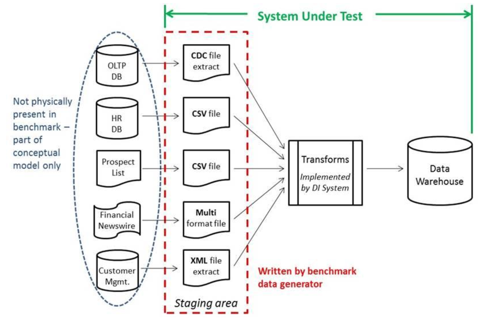
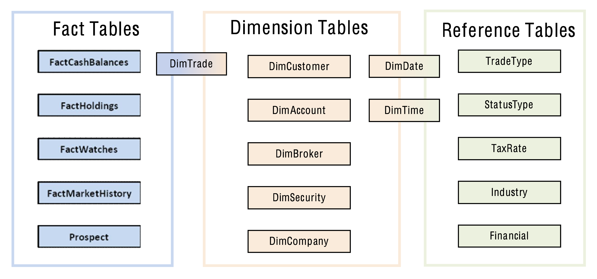
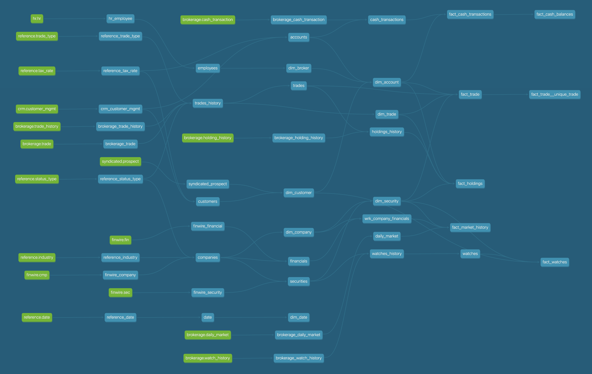
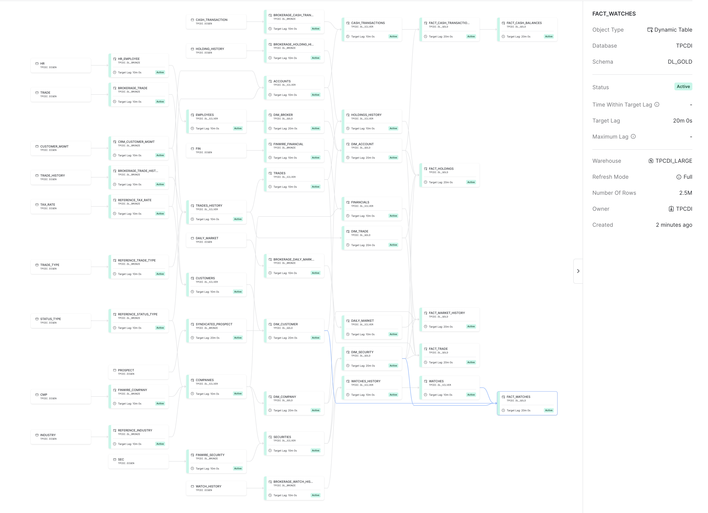

<<<<<<< HEAD
# What is this?
This project contains two distinct portions:
1. A CLI developed using [Snowpark Python](https://docs.snowflake.com/en/developer-guide/snowpark/python/index) and [Typer](https://typer.tiangolo.com/). This CLI creates tables in Snowflake for the files generated by the [TPC-DI](https://www.tpc.org/tpcdi/) benchmark specification.
2. A [dbt](https://www.getdbt.com/) project using [Snowflake Dynamic Tables](https://docs.snowflake.com/en/user-guide/dynamic-tables-about) for building the data warehouse defined in the TPC-DI specification.




I should be clear in my goal here: I am not attempting to _actually run and measure_ the TPC-DI benchmark.
The `tpcdi.py` CLI in this repository is single-threaded and ingests the data sequentially, which would be the worst approach if trying to optimize for a benchmark.
Instead, I needed a dataset that could be used to mimic data engineering workloads inside of Snowflake, so I just wanted the files loaded.





I took a few liberties with the TPC-DI specification to update it a bit for Snowflake. I replaced `CamelCase` names with `SNAKE_CASE`, mostly out of irritation with readability.
Secondly, I just couldn't stand for having the `DimTrade` table be "both a dimension table and a fact table, depending on how it is being used" as it was designed by TPC-DI.
This decision was made during an era when storage and compute were constrained, so in my design, I created both `DIM_TRADE` and `FACT_TRADE` tables.
Finally, I used a Medallion Lakehouse Architecture with Bronze, Silver, and Gold zones, with the logical model above materialized in the Gold zone.

# Demo Notebook
I've included a [demo Jupyter notebook](demo.ipynb) that walks through a subset of the instructions below. This notebook pairs with a presentation I give that focuses more on how Snowpark Python was used in the CLI, and also the motivation for using Dynamic Tables with dbt. But it may still be helpful.

# Using DIGen.jar to Generate Source Files
The Java program to generate the source files is downloaded by [filling out a form on the TPC-DI website](https://www.tpc.org/TPC_Documents_Current_Versions/download_programs/tools-download-request5.asp?bm_type=TPC-DI&bm_vers=1.1.0&mode=CURRENT-ONLY) and clicking a link in an email. Once unzipped, we have to make one slight change for running on macOS:

```bash
unzip 66a2b600-af36-4198-bfbc-c94c40cc22af-tpc-di-tool.zip && \
mv Tools/PDGF Tools/pdgf && \ #clearly written on a case-insensitive OS
cd Tools
```

I couldn't find any way to execute the provided JAR with a Java version newer than `1.8`. I spent some time trying to rebuild the JAR file using a newer Java version for posterity, but it was a fool's errand.
I installed [Azul Zulu Java 1.8](https://www.azul.com/downloads/?package=jdk#zulu) and used [jEnv](https://www.jenv.be/) to set a local version, and with that, we can see the help context from the JAR:

```
jenv add /Library/Java/JavaVirtualMachines/zulu-8.jdk/Contents/Home && \
jenv local 1.8 && \
java -jar DIGen.jar --help

usage: DIGen
 -h                   print this message
 -jvm <JVM options>   JVM options. E.g. -jvm "-Xms1g -Xmx2g"
 -o <directory>       Specify output directory.  Default is output.
 -sf <sf>             Scale factor.  Default value is 5. (range: 3 -
                      2147483647
 -v                   print DIGen version
 ```

This utility will generate a bunch of different data files in various formats with a scaling (or multiplication) factor determining how much data the files contain. 
It attempts to mimic ETL processes at the time the specification was written, which generally utilized file extracts from source systems. It generates CSVs and pipe-separated files (PSVs?), which are quite simple with Snowpark. 
The two file formats that proved the most fun and challenging were fixed-width fields and XML, as both required heavy DataFrame transformations. The files are generated in batches, with `Batch1` representing the historical load, and `Batch2` and `Batch3` representing various incremental loads. 
Currently, I've only tested the loader against `Batch1` and the dbt models have not yet been extended to handle additional batches. 
Also, I haven't yet implemented the Audit portion of the specification, which is somewhat embarrassing as a former co-founder of a data quality company.

```bash
java -jar DIGen.jar -o ~/dev/tpcdi-output -sf 10 && \
ls -lhtr ~/dev/tpcdi-output/Batch1

-rw-r--r--  1 stewartbryson  staff    52B Jul 21 14:30 StatusType_audit.csv
-rw-r--r--  1 stewartbryson  staff    89B Jul 21 14:30 StatusType.txt
-rw-r--r--  1 stewartbryson  staff    52B Jul 21 14:30 TaxRate_audit.csv
-rw-r--r--  1 stewartbryson  staff    17K Jul 21 14:30 TaxRate.txt
-rw-r--r--  1 stewartbryson  staff    52B Jul 21 14:30 Date_audit.csv
-rw-r--r--  1 stewartbryson  staff   3.3M Jul 21 14:30 Date.txt
-rw-r--r--  1 stewartbryson  staff    52B Jul 21 14:30 Time_audit.csv
-rw-r--r--  1 stewartbryson  staff   4.6M Jul 21 14:30 Time.txt
-rw-r--r--  1 stewartbryson  staff    12B Jul 21 14:30 BatchDate.txt
-rw-r--r--  1 stewartbryson  staff   3.9M Jul 21 14:30 HR.csv
-rw-r--r--  1 stewartbryson  staff    84B Jul 21 14:30 HR_audit.csv
-rw-r--r--  1 stewartbryson  staff   391B Jul 21 14:30 CustomerMgmt_audit.csv
-rw-r--r--  1 stewartbryson  staff    30M Jul 21 14:30 CustomerMgmt.xml
-rw-r--r--  1 stewartbryson  staff    10M Jul 21 14:30 Prospect.csv
-rw-r--r--  1 stewartbryson  staff   141B Jul 21 14:30 Prospect_audit.csv
-rw-r--r--  1 stewartbryson  staff    52B Jul 21 14:30 Industry_audit.csv
-rw-r--r--  1 stewartbryson  staff   2.6K Jul 21 14:30 Industry.txt
-rw-r--r--  1 stewartbryson  staff    81K Jul 21 14:30 FINWIRE1967Q1
-rw-r--r--  1 stewartbryson  staff   219B Jul 21 14:30 FINWIRE1967Q1_audit.csv
-rw-r--r--  1 stewartbryson  staff    77K Jul 21 14:30 FINWIRE1967Q2

{ Truncated }
```

# The Python Snowpark Loader: tpcdi.py
I used Conda to build my virtual environment, with all the steps to replicate in the snippet below:

```bash
conda env create -f environment.yml && \
conda activate tpcdi && \
python tpcdi.py --help
```


I created the loader using Typer for the CLI interface and Snowpark for uploading files, creating DataFrames from those files -- in some cases doing heavy transformations -- and saving them as tables. 
Credentials are provided using a credentials.json file in the root directory, and looks like this:

```json
{
    "account": "myaccount",
    "user": "myuser",
    "password": "mypassword",
    "role": "myrole",
    "warehouse": "stewart_dev",
    "database": "tpc_di",
    "schema": "digen"
}
```

Some improvements could be made to the credentials, schema, and database handling.
The utility writes the data to whatever database and schema is specified in the credentials, so those aspects of the connection are required.
Loading the files is accomplished with the process-files command and we can see the help context below:

```
❯ python tpcdi.py process-files --help
```


Let's start by loading a rather simple file - the `StatusType.txt`  which is pipe-delimited. 
I'll first demonstrate the `--show` option, which displays a sample of the DataFrame instead of loading it to a table. 
As you might have guessed, I added this option to aid in the development of the loader. 
Then I'll demonstrate loading the table:

```
❯ python tpcdi.py process-files --output-directory ~/dev/tpcdi-output \
--file-name StatusType.txt --show

File StatusType.txt: UPLOADED
-----------------------
|"ST_ID"  |"ST_NAME"  |
-----------------------
|ACTV     |Active     |
|CMPT     |Completed  |
|CNCL     |Canceled   |
|PNDG     |Pending    |
|SBMT     |Submitted  |
|INAC     |Inactive   |
-----------------------

❯ python tpcdi.py process-files --output-directory ~/dev/tpcdi-output \
--file-name StatusType.txt      

File StatusType.txt: SKIPPED
STATUS_TYPE table created.

❯ snowsql -c demo
* SnowSQL * v1.2.27
Type SQL statements or !help
stewartbryson#STEWART_DEV@TPC_DI.DIGEN>select * from STATUS_TYPE;
+-------+-----------+
| ST_ID | ST_NAME   |
|-------+-----------|
| ACTV  | Active    |
| CMPT  | Completed |
| CNCL  | Canceled  |
| PNDG  | Pending   |
| SBMT  | Submitted |
| INAC  | Inactive  |
+-------+-----------+
6 Row(s) produced. Time Elapsed: 0.752s
stewartbryson#STEWART_DEV@TPC_DI.DIGEN>
```

Notice that the second execution used Snowpark's `overwrite=False` feature of skipping already existing files during a put, which can be overridden with the `--overwrite` option.
For now, let's get the rest of the files loaded so we can move on to the dbt models. 
All DataFrames are saved in `overwrite` mode, so we can run it again without duplicating data:

```bash
❯ python tpcdi.py process-files --output-directory ~/dev/tpcdi-output  

File Date.txt: UPLOADED
DATE table created.
File DailyMarket.txt: UPLOADED
DAILY_MARKET table created.
File Industry.txt: UPLOADED
INDUSTRY table created.
File Prospect.csv: UPLOADED
PROSPECT table created.
File CustomerMgmt.xml: UPLOADED
CUSTOMER_MGMT table created.
File TaxRate.txt: UPLOADED
TAX_RATE table created.
File HR.csv: UPLOADED
HR table created.
File WatchHistory.txt: UPLOADED
WATCH_HISTORY table created.
File Trade.txt: UPLOADED
TRADE table created.
File TradeHistory.txt: UPLOADED
TRADE_HISTORY table created.
File StatusType.txt: SKIPPED
STATUS_TYPE table created.

{ Truncated }
```

# Building the Data Warehouse with dbt
I could have also used Snowpark Python to build the transformation pipelines as well, but instead, I wanted to use Dynamic Tables, and the ability to easily do this using dbt made the decision easy.

In the Medallion architecture, we typically append raw data in their original format into Bronze, business entities modeled in Silver, and our highly curated facts and dimensions in Gold. 
I'm loading with an x-small warehouse and 4 threads, with a `DIGen.jar` scaling factor of 10.
The dbt DAG looks like this:



```bash
❯ dbt build
16:55:34  Running with dbt=1.7.2
16:55:34  Registered adapter: snowflake=1.7.0
16:55:34  Found 45 models, 1 test, 17 sources, 0 exposures, 0 metrics, 544 macros, 0 groups, 0 semantic models
16:55:34  
16:55:36  Concurrency: 20 threads (target='dev')
16:55:36  
16:55:36  1 of 45 START sql dynamic_table model dl_bronze.brokerage_cash_transaction ..... [RUN]
16:55:36  2 of 45 START sql dynamic_table model dl_bronze.brokerage_daily_market ......... [RUN]
16:55:36  3 of 45 START sql dynamic_table model dl_bronze.brokerage_holding_history ...... [RUN]
16:55:36  4 of 45 START sql dynamic_table model dl_bronze.brokerage_trade ................ [RUN]
16:55:36  5 of 45 START sql dynamic_table model dl_bronze.brokerage_trade_history ........ [RUN]
16:55:36  6 of 45 START sql dynamic_table model dl_bronze.brokerage_watch_history ........ [RUN]
16:55:36  7 of 45 START sql dynamic_table model dl_bronze.crm_customer_mgmt .............. [RUN]
16:55:36  8 of 45 START sql dynamic_table model dl_bronze.finwire_company ................ [RUN]
16:55:36  9 of 45 START sql dynamic_table model dl_bronze.finwire_financial .............. [RUN]
16:55:36  10 of 45 START sql dynamic_table model dl_bronze.finwire_security .............. [RUN]
16:55:36  11 of 45 START sql dynamic_table model dl_bronze.hr_employee ................... [RUN]
16:55:36  12 of 45 START sql dynamic_table model dl_bronze.reference_date ................ [RUN]
16:55:36  13 of 45 START sql dynamic_table model dl_bronze.reference_industry ............ [RUN]
16:55:36  14 of 45 START sql dynamic_table model dl_bronze.reference_status_type ......... [RUN]
16:55:36  15 of 45 START sql dynamic_table model dl_bronze.reference_tax_rate ............ [RUN]
16:55:36  16 of 45 START sql dynamic_table model dl_bronze.reference_trade_type .......... [RUN]
16:55:36  17 of 45 START sql dynamic_table model dl_bronze.syndicated_prospect ........... [RUN]
16:55:38  13 of 45 OK created sql dynamic_table model dl_bronze.reference_industry ....... [SUCCESS 1 in 2.54s]
16:55:39  12 of 45 OK created sql dynamic_table model dl_bronze.reference_date ........... [SUCCESS 1 in 2.85s]
16:55:39  18 of 45 START sql dynamic_table model dl_silver.date .......................... [RUN]
16:55:39  14 of 45 OK created sql dynamic_table model dl_bronze.reference_status_type .... [SUCCESS 1 in 3.09s]
16:55:39  15 of 45 OK created sql dynamic_table model dl_bronze.reference_tax_rate ....... [SUCCESS 1 in 3.09s]
16:55:39  16 of 45 OK created sql dynamic_table model dl_bronze.reference_trade_type ..... [SUCCESS 1 in 3.21s]
16:55:39  9 of 45 OK created sql dynamic_table model dl_bronze.finwire_financial ......... [SUCCESS 1 in 3.57s]
16:55:40  8 of 45 OK created sql dynamic_table model dl_bronze.finwire_company ........... [SUCCESS 1 in 4.08s]
16:55:40  11 of 45 OK created sql dynamic_table model dl_bronze.hr_employee .............. [SUCCESS 1 in 4.08s]
16:55:40  19 of 45 START sql dynamic_table model dl_silver.companies ..................... [RUN]
16:55:40  20 of 45 START sql dynamic_table model dl_silver.employees ..................... [RUN]
16:55:40  10 of 45 OK created sql dynamic_table model dl_bronze.finwire_security ......... [SUCCESS 1 in 4.18s]
16:55:40  7 of 45 OK created sql dynamic_table model dl_bronze.crm_customer_mgmt ......... [SUCCESS 1 in 4.32s]
16:55:40  21 of 45 START sql dynamic_table model dl_silver.accounts ...................... [RUN]
16:55:40  22 of 45 START sql dynamic_table model dl_silver.customers ..................... [RUN]
16:55:41  18 of 45 OK created sql dynamic_table model dl_silver.date ..................... [SUCCESS 1 in 2.45s]
16:55:41  23 of 45 START sql dynamic_table model dl_gold.dim_date ........................ [RUN]
16:55:41  17 of 45 OK created sql dynamic_table model dl_bronze.syndicated_prospect ...... [SUCCESS 1 in 5.55s]
16:55:42  1 of 45 OK created sql dynamic_table model dl_bronze.brokerage_cash_transaction  [SUCCESS 1 in 6.55s]
16:55:43  21 of 45 OK created sql dynamic_table model dl_silver.accounts ................. [SUCCESS 1 in 2.52s]
16:55:43  24 of 45 START sql dynamic_table model dl_silver.cash_transactions ............. [RUN]
16:55:43  19 of 45 OK created sql dynamic_table model dl_silver.companies ................ [SUCCESS 1 in 2.77s]
16:55:43  26 of 45 START sql dynamic_table model dl_silver.financials .................... [RUN]
16:55:43  25 of 45 START sql dynamic_table model dl_gold.dim_company ..................... [RUN]
16:55:43  27 of 45 START sql dynamic_table model dl_silver.securities .................... [RUN]
16:55:44  22 of 45 OK created sql dynamic_table model dl_silver.customers ................ [SUCCESS 1 in 3.64s]
16:55:44  28 of 45 START sql dynamic_table model dl_gold.dim_customer .................... [RUN]
16:55:44  20 of 45 OK created sql dynamic_table model dl_silver.employees ................ [SUCCESS 1 in 4.11s]
16:55:44  29 of 45 START sql dynamic_table model dl_gold.dim_broker ...................... [RUN]
16:55:44  4 of 45 OK created sql dynamic_table model dl_bronze.brokerage_trade ........... [SUCCESS 1 in 8.22s]
16:55:44  2 of 45 OK created sql dynamic_table model dl_bronze.brokerage_daily_market .... [SUCCESS 1 in 8.23s]
16:55:44  30 of 45 START sql dynamic_table model dl_silver.daily_market .................. [RUN]
16:55:44  23 of 45 OK created sql dynamic_table model dl_gold.dim_date ................... [SUCCESS 1 in 2.94s]
16:55:44  3 of 45 OK created sql dynamic_table model dl_bronze.brokerage_holding_history . [SUCCESS 1 in 8.49s]
16:55:46  25 of 45 OK created sql dynamic_table model dl_gold.dim_company ................ [SUCCESS 1 in 3.33s]
16:55:47  6 of 45 OK created sql dynamic_table model dl_bronze.brokerage_watch_history ... [SUCCESS 1 in 10.86s]
16:55:47  29 of 45 OK created sql dynamic_table model dl_gold.dim_broker ................. [SUCCESS 1 in 2.98s]
16:55:47  27 of 45 OK created sql dynamic_table model dl_silver.securities ............... [SUCCESS 1 in 4.76s]
16:55:47  31 of 45 START sql dynamic_table model dl_gold.dim_security .................... [RUN]
16:55:47  32 of 45 START sql dynamic_table model dl_silver.watches_history ............... [RUN]
16:55:48  5 of 45 OK created sql dynamic_table model dl_bronze.brokerage_trade_history ... [SUCCESS 1 in 11.82s]
16:55:48  33 of 45 START sql dynamic_table model dl_silver.trades_history ................ [RUN]
16:55:48  28 of 45 OK created sql dynamic_table model dl_gold.dim_customer ............... [SUCCESS 1 in 4.58s]
16:55:48  34 of 45 START sql dynamic_table model dl_gold.dim_account ..................... [RUN]
16:55:49  24 of 45 OK created sql dynamic_table model dl_silver.cash_transactions ........ [SUCCESS 1 in 5.91s]
16:55:49  30 of 45 OK created sql dynamic_table model dl_silver.daily_market ............. [SUCCESS 1 in 4.63s]
16:55:50  26 of 45 OK created sql dynamic_table model dl_silver.financials ............... [SUCCESS 1 in 7.20s]
16:55:51  31 of 45 OK created sql dynamic_table model dl_gold.dim_security ............... [SUCCESS 1 in 3.81s]
16:55:51  35 of 45 START sql dynamic_table model dl_gold.fact_market_history ............. [RUN]
16:55:52  34 of 45 OK created sql dynamic_table model dl_gold.dim_account ................ [SUCCESS 1 in 3.71s]
16:55:52  36 of 45 START sql dynamic_table model dl_gold.fact_cash_transactions .......... [RUN]
16:55:54  32 of 45 OK created sql dynamic_table model dl_silver.watches_history .......... [SUCCESS 1 in 6.08s]
16:55:54  37 of 45 START sql dynamic_table model dl_silver.watches ....................... [RUN]
16:55:58  36 of 45 OK created sql dynamic_table model dl_gold.fact_cash_transactions ..... [SUCCESS 1 in 5.65s]
16:55:58  38 of 45 START sql dynamic_table model dl_gold.fact_cash_balances .............. [RUN]
16:56:00  37 of 45 OK created sql dynamic_table model dl_silver.watches .................. [SUCCESS 1 in 6.13s]
16:56:00  39 of 45 START sql dynamic_table model dl_gold.fact_watches .................... [RUN]
16:56:00  33 of 45 OK created sql dynamic_table model dl_silver.trades_history ........... [SUCCESS 1 in 12.60s]
16:56:00  40 of 45 START sql dynamic_table model dl_gold.dim_trade ....................... [RUN]
16:56:00  41 of 45 START sql dynamic_table model dl_silver.trades ........................ [RUN]
16:56:03  38 of 45 OK created sql dynamic_table model dl_gold.fact_cash_balances ......... [SUCCESS 1 in 5.45s]
16:56:05  40 of 45 OK created sql dynamic_table model dl_gold.dim_trade .................. [SUCCESS 1 in 4.51s]
16:56:06  39 of 45 OK created sql dynamic_table model dl_gold.fact_watches ............... [SUCCESS 1 in 6.40s]
16:56:08  41 of 45 OK created sql dynamic_table model dl_silver.trades ................... [SUCCESS 1 in 7.40s]
16:56:08  42 of 45 START sql dynamic_table model dl_silver.holdings_history .............. [RUN]
16:56:08  43 of 45 START sql dynamic_table model dl_gold.fact_trade ...................... [RUN]
16:56:15  42 of 45 OK created sql dynamic_table model dl_silver.holdings_history ......... [SUCCESS 1 in 7.03s]
16:56:15  44 of 45 START sql dynamic_table model dl_gold.fact_holdings ................... [RUN]
16:56:22  43 of 45 OK created sql dynamic_table model dl_gold.fact_trade ................. [SUCCESS 1 in 14.53s]
16:56:22  45 of 45 START test fact_trade__unique_trade ................................... [RUN]
16:56:23  45 of 45 PASS fact_trade__unique_trade ......................................... [PASS in 1.30s]
16:56:25  44 of 45 OK created sql dynamic_table model dl_gold.fact_holdings .............. [SUCCESS 1 in 9.95s]
16:56:44  35 of 45 OK created sql dynamic_table model dl_gold.fact_market_history ........ [SUCCESS 1 in 53.21s]
16:56:44  
16:56:44  Finished running 44 dynamic_table models, 1 test in 0 hours 1 minutes and 10.51 seconds (70.51s).
16:56:45  
16:56:45  Completed successfully
16:56:45  
16:56:45  Done. PASS=45 WARN=0 ERROR=0 SKIP=0 TOTAL=45
```

Once the DAG has been created in Snowflake, we can browse it in the UI:



It's important to note that Snowflake is only aware of all the dependent relations _after_ the tables have been created.
dbt is aware of them before.

# Future Enhancements
Although it wasn't my goal, it would be cool to enhance this project so that it could be used to run and measure the benchmark. 
These are my thoughts on where to take this next:

1. Complete `Batch2` and `Batch3` using dbt incremental models, and put the audit queries in as dbt tests.
2. Refactor tpcdi.py to only upload the files and do that concurrently, then put all the Snowpark transformations into procedures so they can be executed as concurrent tasks.
3. Maybe take another pass at credential handling, using the `config.toml` from [Snowflake CLI](https://github.com/snowflake-labs/snowcli#cli-tour-and-quickstart).
Provide a command-line option `--schema` so it can be specified during loading, instead of using `CURRENT_SCHEMA`.

If you are interested in contributing, jump on board. You don't need my permission, or even incredible skill, clearly. 
Just open a pull request.
=======
# DBTPCDI

This repo is an end to end implementation of
[TPC-DI](https://www.tpc.org/tpcdi/default5.asp). The repo is desinged to
be run against Databricks, Snowflake, BigQuery, Redshift, and Synapse.
You can select your desired target warehouse with different targets that
are defined in the profiles.yml; for ex `dbt run --target databricks`
will build the TPCDI tables in Databricks while `dbt run --target redshift`
will build the tables in Redshift. The default is to build the tables in Databricks but you 
can build the tables in other warehouses by adjusting the model-paths key to the desried warehouse 
The steps below will be applicable regardless of the target warehouse. For warehouse specific considerations,
refer to the read.me within the relevant directories of the models directory. 

## Data Preparation 
This project uses the TPC-DI Kit TPC-DI Data Generator https://github.com/haydarai/tpcdi-kit

### Generating test data files
Using the DIGen Tool

```shell
java -jar DIGen.jar -o ../staging/10/ -sf 10
```
Once data files is generated, upload the files to your working cloud
storage account. We recommend using the cli tool for the relevant cloud
(aws CLI for Redshift, azure SLI for synapse, gcloud sli for big query,
etc). 

Please refer to the individual readmes to determine how to best handle the
customermgmt xml file.


### Configuration and running

(Note that do not run dbt deps as some of the packages/macros the code relies on are custom)
1. create your prod and staging schemas (if not already created)
2. Update profiles.yml with your prod schema and other warehouse specific
configurations.
3. Update project.yml with desired scalefactor, bucketname, and staging schema
4. dbt run-operation stage_external_sources
5. dbt run

### Contributing

Additional contributions are welcome.

For small changes, please submit a pull request with your changes.

For larger changes that would change the majority of code in a single
file or span multiple files, please open an issue first for discussion.

#### Linting

This project uses several formatters and linters for different file types. Each linter should be run before submitting
a pull request and the appropriate changes should be made to resolve any errors or warnings. This projects has
built-in checks that will run automatically when a pull request is submitted and need to pass before the pull request
can be merged. The file `dev-requirements.txt` contains the packages needed to run the linters. 

The `dev-requirements.txt` file can be used to install all of the packages at once with the command
`pip install -r dev-requirements.txt`. It's considered best practice to install the packages in a python virtual
environment.

Instructions to install each package will be linked below if you do not wish to use the `dev-requirements.txt` file.

##### yaml
We use [yamllint](https://yamllint.readthedocs.io/en/stable/) to lint the yaml files. To run the linter, run
`yamllint .` from the root of the project. Errors and warnings will be printed to the console for review.

[Instructions to install yamllint](https://yamllint.readthedocs.io/en/stable/quickstart.html#installing-yamllint).

##### python
We use [black](https://black.readthedocs.io/en/stable/usage_and_configuration/the_basics.html) to format and
[flake8](https://flake8.pycqa.org/en/latest/) to lint python files. In addition, `black-jupyter` is an extension of
`black` for Jupyter Notebooks, which end with an `.ipynb` extension.

We recommend running `black .` to format code prior to `flake8 .` to lint the code since `black` will auto-correct
many `flake8` violations. Errors and warnings will be printed to the console for review by both tools.

[Instructions to install black](https://black.readthedocs.io/en/stable/installation_and_usage.html#installing-black).
[Instructions to install flake8](https://flake8.pycqa.org/en/latest/#installation).
[Instructions to install black-jupyter](https://github.com/n8henrie/jupyter-black).

##### sql
We use [sqlfluff](https://docs.sqlfluff.com/en/stable/) to lint the sql files. To run the formatter, run
`sqlfluff format .`, and to run the linter, run `sqlfluff lint .` from the root of the project. Errors and warnings will
be printed to the console for review.

No additional configurations, including specification of the SQL dialect is required since the project uses a global
`.sqlfluff` file at the root directory to manage configurations and a `.sqlfluff` file to specify the dialect for each
Warehouse directory.
>>>>>>> fd9accdd82af8535c136a834748a6de529460433
